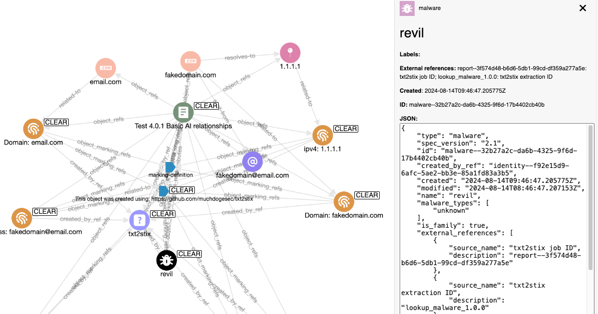

# txt2stix

## Overview



txt2stix is a Python script that is designed to identify and extract IoCs and TTPs from text files, identify the relationships between them, convert them to STIX 2.1 objects, and output as a STIX 2.1 bundle.

The general design goal of txt2stix was to keep it flexible, but simple, so that new extractions could be added or modified over time.

In short txt2stix;

1. takes a txt file input
2. extracts observables for enabled extractions (ai, pattern, or lookup)
3. converts extracted observables to STIX 2.1 objects
4. generates the relationships between extracted observables (ai, standard)
5. converts extracted relationships to STIX 2.1 SRO objects
6. outputs a STIX 2.1 bundle

## tl;dr

[](https://www.youtube.com/watch?v=TWVGCou9oGk)

[Watch the demo](https://www.youtube.com/watch?v=TWVGCou9oGk).

## Usage

### Setup

Install the required dependencies using:

```shell
# clone the latest code
git clone https://github.com/muchdogesec/txt2stix
cd txt2stix
# create a venv
python3 -m venv txt2stix-venv
source txt2stix-venv/bin/activate
# install requirements
pip install .
```

### Set variables

txt2stix has various settings that are defined in an `.env` file.

To create a template for the file:

```shell
cp .env.example .env
```

To see more information about how to set the variables, and what they do, read the `.env.markdown` file.

### Usage

```shell
python3 txt2stix.py \
	--relationship_mode MODE \
	--input_file FILE.txt \
	...
```

The following arguments are available:

#### Input settings

* `--input_file` (REQUIRED): the file to be converted. Must be `.txt`

#### STIX Report generation settings


* `--name` (REQUIRED): name of file, max 72 chars. Will be used in the STIX Report Object created.
* `--report_id` (OPTIONAL): Sometimes it is required to control the id of the `report` object generated. You can therefore pass a valid UUIDv4 in this field to be assigned to the report. e.g. passing `2611965-930e-43db-8b95-30a1e119d7e2` would create a STIX object id `report--2611965-930e-43db-8b95-30a1e119d7e2`. If this argument is not passed, the UUID will be randomly generated.
* `--tlp_level` (OPTIONAL): Options are `clear`, `green`, `amber`, `amber_strict`, `red`. Default if not passed, is `clear`.
* `--confidence` (OPTIONAL): value between 0-100. Default if not passed is null.
* `--labels` (OPTIONAL): comma seperated list of labels. Case-insensitive (will all be converted to lower-case). Allowed `a-z`, `0-9`. e.g.`label1,label2` would create 2 labels.
* `--created` (OPTIONAL): by default all object `created` times will take the time the script was run. If you want to explicitly set these times you can do so using this flag. Pass the value in the format `YYYY-MM-DDTHH:MM:SS.sssZ` e.g. `2020-01-01T00:00:00.000Z`
* `--use_identity` (OPTIONAL): can pass a full STIX 2.1 identity object (make sure to properly escape). Will be validated by the STIX2 library.
* `--external_refs` (OPTIONAL): txt2stix will automatically populate the `external_references` of the report object it creates for the input. You can use this value to add additional objects to `external_references`. Note, you can only add `source_name` and `external_id` values currently. Pass as `source_name=external_id`. e.g. `--external_refs txt2stix=demo1 source=id` would create the following objects under the `external_references` property: `{"source_name":"txt2stix","external_id":"demo1"},{"source_name":"source","external_id":"id"}`

#### Output settings

How the extractions are performed

* `--use_extractions` (REQUIRED): if you only want to use certain extraction types, you can pass their slug found in either `includes/ai/config.yaml`, `includes/lookup/config.yaml` `includes/pattern/config.yaml` (e.g. `pattern_ipv4_address_only`). Default if not passed, no extractions applied.
	* Important: if using any AI extractions, you must set an OpenAI API key in your `.env` file
	* Important: if you are using any MITRE ATT&CK, CAPEC, CWE, ATLAS or Location extractions you must set `CTIBUTLER` or NVD CPE or CVE extractions you must set `VULMATCH` settings in your `.env` file
* `--relationship_mode` (REQUIRED): either.
	* `ai`: AI provider must be enabled. extractions performed by either regex or AI for extractions user selected. Rich relationships created from AI provider from extractions.
	* `standard`: extractions performed by either regex or AI (AI provider must be enabled) for extractions user selected. Basic relationships created from extractions back to master Report object generated.

#### AI settings

If any AI extractions, or AI relationship mode is set, you must set the following accordingly

* `--ai_settings_extractions`:
	* defines the `provider:model` to be used for extractions. You can supply more than one provider. Seperate with a space (e.g. `gpt-4o claude-3-opus-latest`) If more than one provider passed, txt2stix will take extractions from all models, de-dupelicate them, and them package them in the output. Currently supports:
		* Provider: `openai:`, models e.g.: `gpt-4o`, `gpt-4o-mini`, `gpt-4-turbo`, `gpt-4` ([More here](https://platform.openai.com/docs/models))
		* Provider: `anthropic:`, models e.g.: `claude-3-5-sonnet-latest`, `claude-3-5-haiku-latest`, `claude-3-opus-latest` ([More here](https://docs.anthropic.com/en/docs/about-claude/models))
		* Provider: `gemini:models/`, models: `gemini-1.5-pro-latest`, `gemini-1.5-flash-latest` ([More here](https://ai.google.dev/gemini-api/docs/models/gemini))
	* See `tests/manual-tests/cases-ai-extraction-type.md` for some examples
* `--ai_settings_relationships`:
	* similar to `ai_settings_extractions` but defines the model used to generate relationships. Only one model can be provided. Passed in same format as `ai_settings_extractions`
	* See `tests/manual-tests/cases-ai-relationships.md` for some examples

## Adding new extractions

It is very likely you'll want to extend txt2stix to include new extractions to;

* Add a new lookup extraction: add your lookup to `includes/lookups` as a `.txt` file. Lookups should be a list of items seperated by new lines to be searched for in documents. Once this is added, update `includes/extractions/lookup/config.yaml` with a new record pointing to your lookup. You can now use this lookup time at script run-time.
* Add a new AI extraction: Edit `includes/extractions/ai/config.yaml` with a new record for your extraction. You can craft the prompt used in the config to control how the LLM performs the extraction.

Currently it is not possible to easily add any other types of extractions (without modifying the logic at a code level).

## Detailed documentation

If you would like to understand how txt2stix works in more detail, please refer to the documentation in `/docs/README.md`.

This documentation is paticularly helpful to read for those of you wanting to add your own custom extractions.

## Useful supporting tools

* [Python Validators](https://validators.readthedocs.io/en/latest/#)
* [STIX 2](https://pypi.org/project/stix2/): APIs for serializing and de-serializing STIX2 JSON content
* [STIX 2 Pattern Validator](https://pypi.org/project/stix2-patterns/): a tool for checking the syntax of the Cyber Threat Intelligence (CTI) STIX Pattern expressions
* [MISP Warning Lists](https://github.com/MISP/misp-warninglists): Warning lists to inform users of MISP about potential false-positives or other information in indicators
* [STIX Viewer](https://github.com/traut/stixview): Quickly load bundles produced from your report

## Support

[Minimal support provided via the DOGESEC community](https://community.dogesec.com/).

## License

[Apache 2.0](/LICENSE).